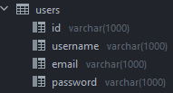

# Account Manager with the Stripe API
A paid account manager creation using the Stripe API.
In 
## How it works ?
For this to work you must complete the `config.php` file with your website information.
To find your **public** and **secret** stripe _**API keys**_ go to their official website: https://dashboard.stripe.com/

## Database Manager
If you want to use a database please create one (on your phpmyadmin page) then put a table called "users" with these properties:

Please don't hesitate to contact me if you have any problem!
